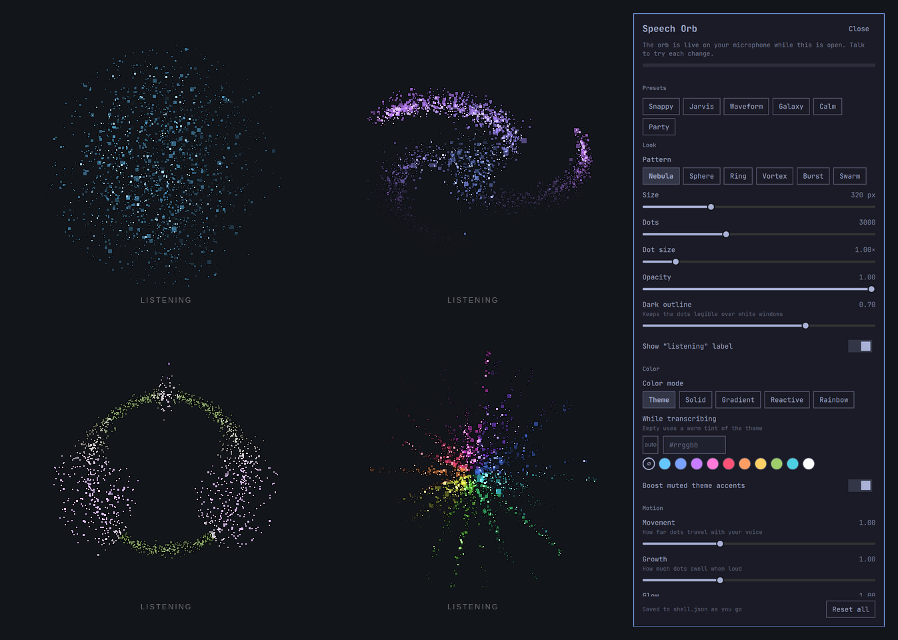
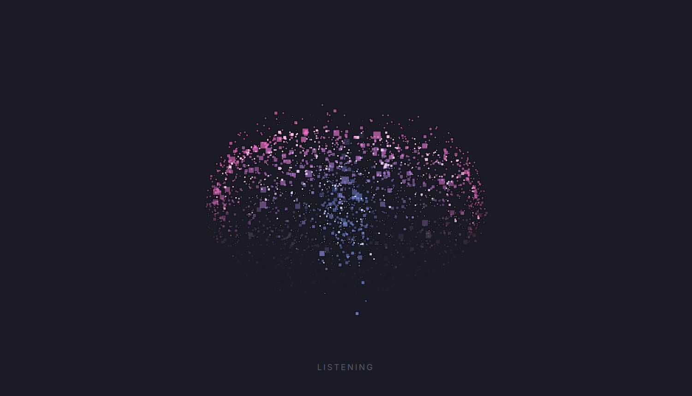
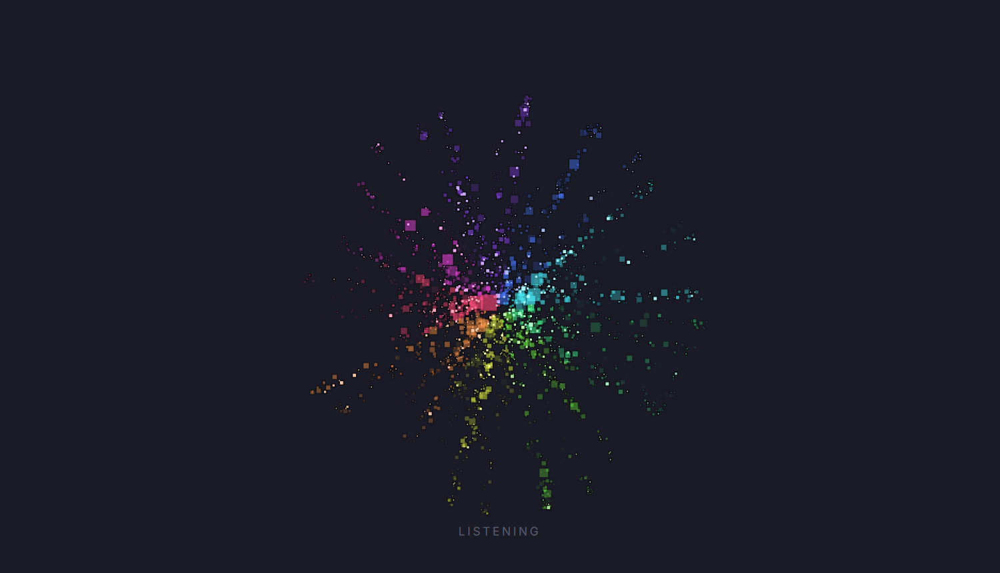
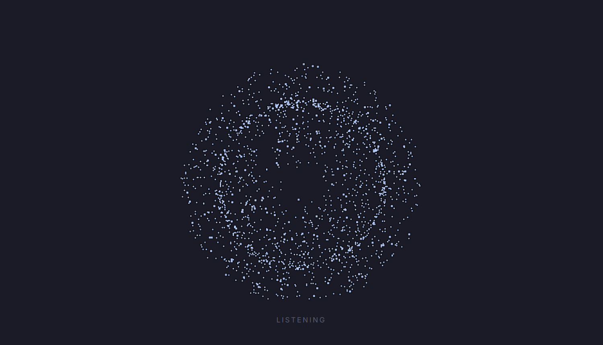
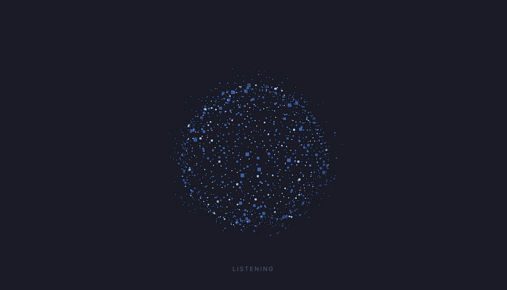
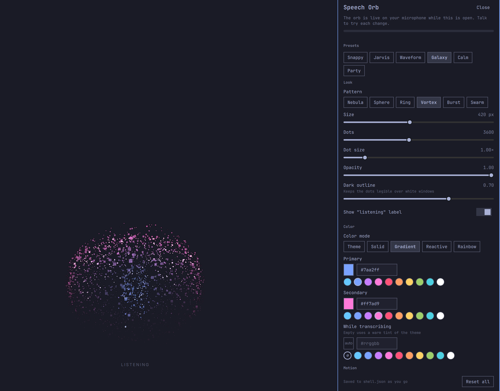

# Speech Orb

An [Omarchy](https://omarchy.org) shell plugin that shows a particle orb while
you dictate with [voxtype](https://github.com/peteonrails/voxtype), and moves
it with your voice in real time.



- **No perceptible lag.** The mic is metered straight from PipeWire, once per
  audio quantum (~21 ms), and loudness rises on the very next frame. There is
  no smoothing on the way up and no delay line unless you ask for one.
- **Seven patterns.** Nebula, Sphere, Ring (your waveform wrapped into a
  circle), Vortex, Burst, Swarm, and Logo: the square Omarchy logo, which
  breathes apart as you speak.
- **Your colors.** Follow the theme, or pick a solid color, a gradient, a
  color that shifts with loudness, or a slowly turning rainbow.
- **Tunable movement and sensitivity**, from a settings window where the orb
  is live on your mic, so you judge each change by talking.

## Install

```sh
omarchy plugin add https://github.com/nodrej/omarchy-speech-orb.git --enable
```

Then turn off voxtype's own on-screen display, so you don't get two:

```sh
voxtype config set osd.enabled false
```

Restart the voxtype daemon for that to take effect (or log out and back in).

### Requirements

- Omarchy with the Quickshell shell (Quickshell 0.3 or newer, for
  `PwNodePeakMonitor`).
- voxtype, which Omarchy installs for dictation. The orb reads its state file at
  `$XDG_RUNTIME_DIR/voxtype/state`; nothing else about voxtype is touched.
- PipeWire.

No other packages, scripts or binaries.

## Usage

Dictate as usual (Omarchy binds this to <kbd>F9</kbd>). The orb fades in while
voxtype is listening, breathes while it transcribes, and fades out when it is
done. It sits above everything, never takes focus, and clicks pass straight
through it.

### Opening the settings

Click the **Speech Orb icon in the bar**, a small disc of dots on the right.
It lights up while you dictate.

- **Left click** opens the settings window.
- **Right click** shows the orb on your live mic for 20 seconds, without
  dictating.

Don't want the icon? Turn off **Show icon in the bar** in the settings. You
can still open them from a terminal or a keybinding:

```sh
omarchy-shell speech-orb settings
```

While the window is open the orb is live on your microphone in its real
position. There is a level meter at the top: normal speech should land well
into the bar, and silence should leave it empty. Press <kbd>Esc</kbd> or
**Close** when you're done. Every change saves as you make it.

Other commands:

| Command | Does |
|---|---|
| `omarchy-shell speech-orb preview` | Show the orb on your live mic for 20 s (run again to stop) |
| `omarchy-shell speech-orb preset <name>` | `snappy`, `jarvis`, `waveform`, `galaxy`, `calm`, `omarchy` or `party` |
| `omarchy-shell speech-orb set <key> <value>` | Change one setting, e.g. `set movement 1.6` |
| `omarchy-shell speech-orb reset` | Back to defaults |
| `omarchy-shell speech-orb status` | JSON: state, mic, live level, non-default settings |

The microphone is only opened while the orb is showing: during a dictation,
or while the settings window or a preview is up.

## Screenshots

| | |
|---|---|
|  |  |
|  |  |



## Configure

Everything in the settings window lives in this plugin's entry in
`~/.config/omarchy/shell.json`. Only the values you change are stored, and edits
to the file apply as soon as you save it:

```json
{
  "plugins": [
    {
      "id": "io.github.nodrej.speech-orb",
      "pattern": "vortex",
      "colorMode": "gradient",
      "color": "#7aa2ff",
      "color2": "#ff7ad9",
      "movement": 1.4,
      "sensitivity": 1.3
    }
  ]
}
```

| Key | Default | Range / meaning |
|---|---|---|
| **Look** | | |
| `pattern` | `"nebula"` | `nebula`, `sphere`, `ring`, `vortex`, `burst`, `swarm`, `logo` — Pattern |
| `size` | `320` | 120 – 800 px — Size |
| `dotCount` | `3000` | 200 – 8000 — Dots |
| `dotSize` | `1` | 0.5 – 4 × — Dot size |
| `opacity` | `1` | 0.1 – 1 — Opacity |
| `outline` | `0.7` | 0 – 1 — Keeps the dots legible over white windows |
| `showLabel` | `true` | `true` / `false` — Show "listening" label |
| **Color** | | |
| `colorMode` | `"theme"` | `theme`, `solid`, `gradient`, `reactive`, `rainbow` — Color mode |
| `color` | `"#66c7ff"` | `#rrggbb` — Primary |
| `color2` | `"#c77dff"` | `#rrggbb` — Secondary |
| `transcribingColor` | `""` | `#rrggbb` or `""` — Empty uses a warm tint of the theme |
| `vivid` | `true` | `true` / `false` — Boost muted theme accents |
| `rainbowSpeed` | `0.25` | 0 – 2 — Rainbow speed |
| **Motion** | | |
| `movement` | `1` | 0 – 3 — How far dots travel with your voice |
| `growth` | `1` | 0 – 3 — How much dots swell when loud |
| `glow` | `1` | 0 – 3 — How much dots brighten when loud |
| `turbulence` | `1` | 0 – 3 — Ambient drift, independent of volume |
| `spinSpeed` | `1` | -3 – 3 — Spin speed |
| `ripple` | `0` | 0 – 600 ms — 0 = the whole orb answers at once. Higher lets loudness travel outward from the core |
| **Sensitivity** | | |
| `sensitivity` | `1` | 0.2 – 4 — Sensitivity |
| `autoGain` | `true` | `true` / `false` — Learns your mic's noise floor and speaking level |
| `floorDb` | `-50` | -90 – -20 dB — Manual mode: at or below this reads as silence |
| `ceilDb` | `-12` | -40 – 0 dB — Manual mode: at or above this reads as flat out |
| `attackMs` | `0` | 0 – 200 ms — 0 = jumps the instant you speak |
| `releaseMs` | `140` | 20 – 800 ms — How long it takes to settle after a syllable |
| `micNode` | `""` | text — PipeWire node name. Empty follows the default input |
| **Placement** | | |
| `position` | `"bottom-center"` | `top-left`, `top-center`, `top-right`, `center`, `bottom-left`, `bottom-center`, `bottom-right` — Position |
| `margin` | `72` | 0 – 600 px — Edge gap |
| `offsetX` | `0` | -1200 – 1200 px — Nudge sideways |
| `monitor` | `""` | text — Output name such as DP-1. Empty follows the focused monitor |
| `showWhenTranscribing` | `true` | `true` / `false` — Stay up while transcribing |
| `barIcon` | `true` | `true` / `false` — Click it for these settings. Hidden, use: omarchy-shell speech-orb settings |
| `fadeMs` | `140` | 0 – 1000 ms — Fade |

### Sensitivity, briefly

Loudness is mapped in dBFS, not raw amplitude, because hearing is
logarithmic.

- **Auto gain** (on by default) learns two things. The noise floor is the
  quietest reading in the last 3 s. Speech always dips back to the room
  between words, so this settles within seconds on any mic. The speaking level
  is your recent peaks, which slowly decay.
- **Manual mode.** With auto gain off, `floorDb` and `ceilDb` set the range
  directly. Use this if auto gain misjudges your setup.
- **`sensitivity`** scales the result either way.

The meter in the settings window shows the input level and the range it is
being mapped through.

### Movement, briefly

- **`movement`**: how far dots travel with your voice.
- **`growth`** and **`glow`**: how much dots swell and brighten when loud.
- **`turbulence`**: the ambient drift, which runs regardless of volume.
- **`spinSpeed`**: how fast the orb turns. Set it to 0 to stop it, or make it
  negative to reverse it.
- **`ripple`**: how long loudness takes to travel from the centre outward. At
  0 the whole orb answers at once. The `jarvis` preset sets it to 340 ms for a
  rolling wave.
- **`attackMs`** and **`releaseMs`**: how quickly the level rises and falls.
  At the default attack of 0 it rises instantly.

## Why it is fast

The orb that inspired this was driven by voxtype's audio socket, which delivers
level frames in bursts of 3–6 at a time (30–60 ms apart, measured). On top of
that it eased every rise in over ~90 ms and made most of the cloud answer 100 to
350 ms late through its outward ripple.

This plugin does three things differently:

1. It reads peaks from PipeWire directly. Updates arrive every ~21 ms, evenly
   spaced.
2. It keeps the loudest peak since the last frame, so no syllable falls
   between frames.
3. It shows each rise on the next frame, with no smoothing and no ripple by
   default.

Drawing 3000 dots costs about 1 ms of JavaScript per frame.

## Remove

```sh
omarchy plugin remove io.github.nodrej.speech-orb
voxtype config set osd.enabled true
```

The second line brings back voxtype's own display. Restart voxtype afterwards.

## Development

```sh
node --test tests/                         # settings, level math, every pattern
qml dev/preview.qml                        # the orb alone, on synthetic speech
qml dev/preview.qml -- pattern=ring step   # any setting, or a hard on/off test signal
```

The shell does not reload a service plugin's QML on save. Run
`omarchy restart shell` after editing it.

## License

MIT. See [LICENSE](LICENSE).
